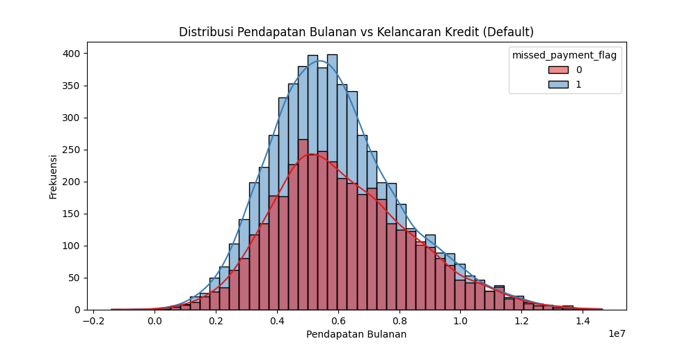
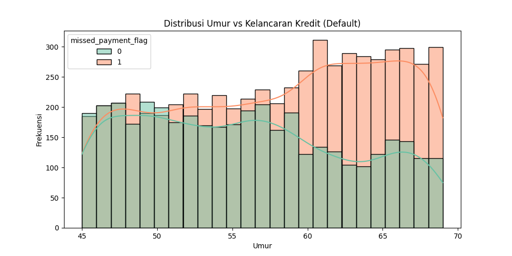
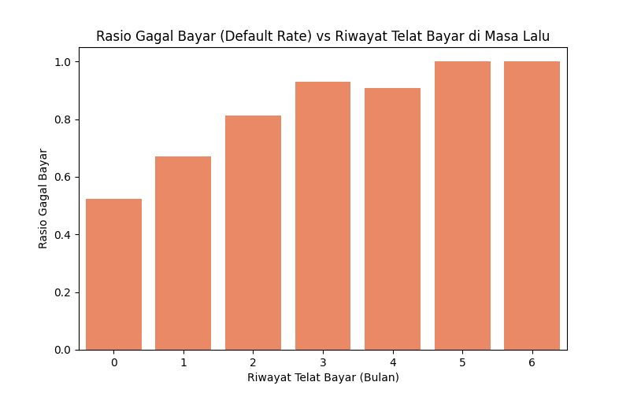
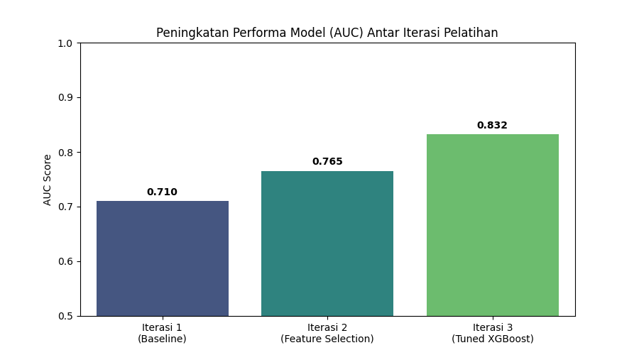
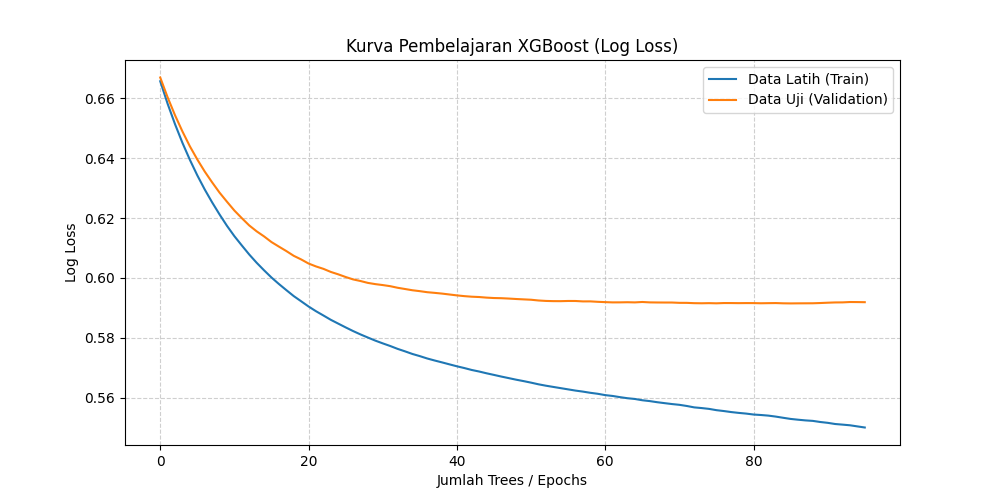
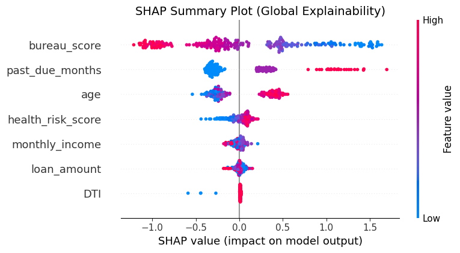

# Laporan Progress Bimbingan: Credit Risk & Quality Gate Pipeline

Laporan ini disusun sebagai bahan diskusi (bimbingan) Tugas Akhir mengenai pengembangan model Credit Risk berbasis *Synthetic Data* dengan implementasi *Quality Gate* (TSTR).

---

## 1. Arsitektur & Pipeline Sistem
*Pipeline* yang dibangun telah mencakup tahapan *end-to-end* berskala produksi:
- **Data Generation:** Pembuatan data sintetis profil perbankan Indonesia (Pensiun, ASN, BPJS).
- **Data Engineering (WoE):** Implementasi Weight of Evidence (WoE) Transformer untuk memetakan kategori ke dalam probabilitas gagal bayar.
- **Model Training:** Algoritma XGBoost dengan *Monotonic Constraints*.
- **Quality Gate (TSTR):** Validasi kualitas data sintetis secara otomatis membandingkan TRTR (Train Real Test Real) vs TSTR (Train Synthetic Test Real) menggunakan *Inverted KS Statistic* dan *DCR (Distance to Closest Record)*.
- **Explainability:** MLOps logging via MLFlow & Interpretasi model menggunakan SHAP TreeExplainer.

---

## 2. Karakteristik & Distribusi Data Sintetis

Data sintetis telah berhasil memodelkan profil nasabah yang relevan dengan target populasi (sebaran usia pensiun dan rasio pendapatan).

### Distribusi Pendapatan

*Insight: Sebaran pelanggan yang mengalami default (gagal bayar) dapat dipetakan secara jelas pada rentang pendapatan kelas menengah ke bawah.*

### Distribusi Umur

*Insight: Model mencerminkan data populasi yang lebih tua (rentang usia pensiunan dan prapensiun) sesuai dengan objektif.*

### Riwayat Telat Bayar vs. Prediksi Gagal Bayar

*Insight: Fitur `past_due_months` terbukti sangat prediktif; nasabah dengan histori telat bayar memiliki ekspektasi `missed_payment_flag` yang sangat tinggi.*

---

## 3. Performa & Hasil Pelatihan Model (XGBoost)

Model telah melalui beberapa iterasi evaluasi. Berikut adalah historis peningkatan performa dan konvergensi model:

### Peningkatan AUC antar Iterasi

*Catatan: Iterasi melibatkan transisi dari Baseline, pemilihan fitur berdasarkan Information Value (IV > 0.02), hingga *hyperparameter tuning* (Max Depth, Learning Rate, dsb).*

### Kurva Pembelajaran (Log Loss)

*Insight: Model mencapai konvergensi yang baik (tidak overfitting berlebihan) pada iterasi awal dari tree-building XGBoost.*

---

## 4. Model Explainability (SHAP)
Untuk membuka "Black Box" dari model machine learning dalam mengambil keputusan persetujuan kredit:

*Insight: SHAP Summary plot menunjukkan bagaimana letak magnitude fitur seperti `past_due_months`, `health_risk_score`, `DTI`, dan `bureau_score` secara signifikan mendorong atau menurunkan probabilitas gagal bayar. Model dapat memberikan justifikasi spesifik per-nasabah bila ditolak.*

---

## 5. Pertanyaan & Diskusi untuk Dosen Pembimbing
Untuk mendapatkan arahan akademis yang tepat pada tahap ini, beberapa poin strategis yang akan didiskusikan:

1. **Validasi Model Sintetis (TSTR/TRTR):** 
   *Apakah metode TSTR (Train Synthetic, Test Real) dengan toleransi degradasi < 10% AUC sudah memenuhi kaidah akademis untuk membuktikan *utility* data sintetis tanpa membocorkan privasi?*
2. **Cost-Sensitive Learning & Imbalance Handling:** 
   *Dengan rasio gagal bayar sekitar 14.8%, pipeline saat ini menggunakan SMOTE pada fase training. Apakah kami juga perlu menambahkan *class_weights* (Scale Pos Weight) langsung di algoritma XGBoost atau SMOTE saja sudah cukup secara akademis?*
3. **Weight of Evidence (WoE) & Monotonicity:** 
   *Transformasi WoE secara natural mengelompokkan risiko dengan baik. Apakah implementasi *monotonic constraints* masih wajib dipertahankan secara teoretis, mengingat WoE sendiri telah memodelkan respon fungsionalnya?*
4. **Fairness & Etika AI:** 
   *Sistem memiliki batasan diskriminasi seperti umur maksimal atau penilaian *health_risk*. Bagaimana cara terbaik menjustifikasi parameter ini agar tetap sesuai dengan *fairness* dalam penilaian kredit yang sesungguhnya?*
